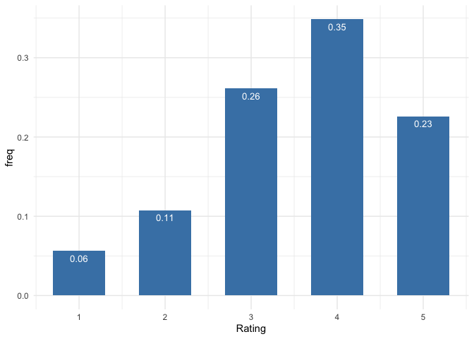
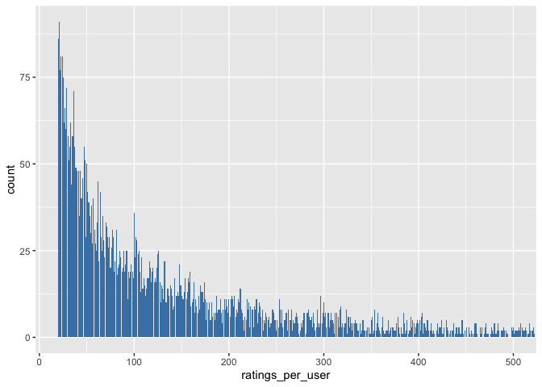
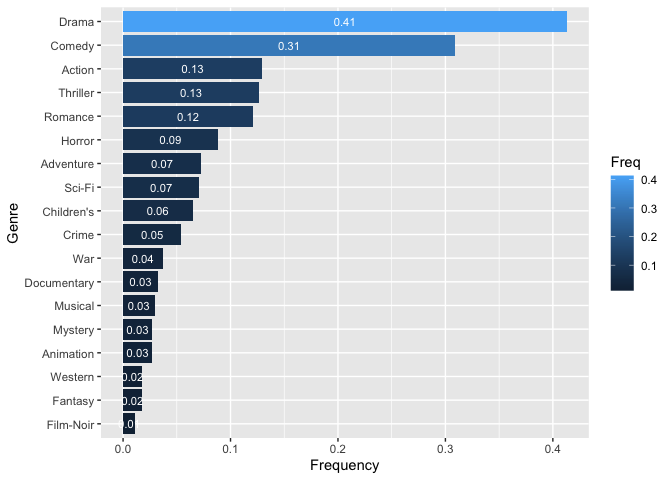
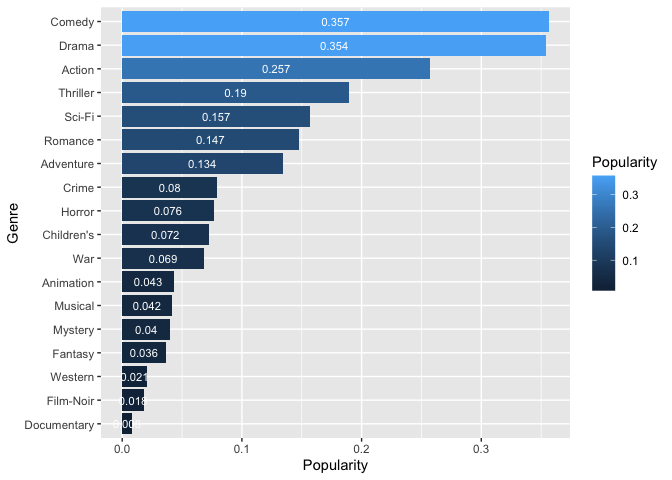
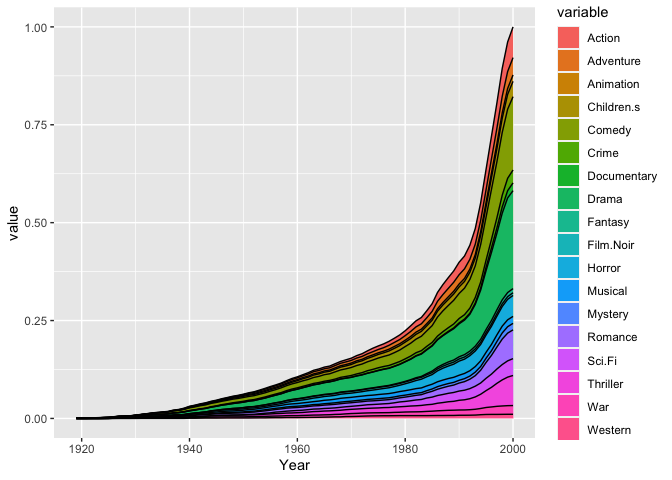

``` r
# Load necessary libraries
library(dplyr)
```

    ## 
    ## Attaching package: 'dplyr'

    ## The following objects are masked from 'package:stats':
    ## 
    ##     filter, lag

    ## The following objects are masked from 'package:base':
    ## 
    ##     intersect, setdiff, setequal, union

``` r
library(ggplot2)
library(recommenderlab)
```

    ## Loading required package: Matrix

    ## Loading required package: arules

    ## 
    ## Attaching package: 'arules'

    ## The following object is masked from 'package:dplyr':
    ## 
    ##     recode

    ## The following objects are masked from 'package:base':
    ## 
    ##     abbreviate, write

    ## Loading required package: proxy

    ## 
    ## Attaching package: 'proxy'

    ## The following object is masked from 'package:Matrix':
    ## 
    ##     as.matrix

    ## The following objects are masked from 'package:stats':
    ## 
    ##     as.dist, dist

    ## The following object is masked from 'package:base':
    ## 
    ##     as.matrix

    ## Registered S3 methods overwritten by 'registry':
    ##   method               from 
    ##   print.registry_field proxy
    ##   print.registry_entry proxy

``` r
library(DT)
library(data.table)
```

    ## 
    ## Attaching package: 'data.table'

    ## The following objects are masked from 'package:dplyr':
    ## 
    ##     between, first, last

``` r
library(reshape2)
```

    ## 
    ## Attaching package: 'reshape2'

    ## The following objects are masked from 'package:data.table':
    ## 
    ##     dcast, melt

## Download Data

``` r
myurl = "https://raw.githubusercontent.com/Vivek2696/movie-recommender/main/data/"
```

Check the readme file to understand the format of the other three files.
You can also download them from the original site:
<https://grouplens.org/datasets/movielens/>.

## Read in data

### ratings data

``` r
# use colClasses = 'NULL' to skip columns
ratings = read.csv(paste0(myurl, 'ratings.dat?raw=true'), 
                   sep = ':',
                   colClasses = c('integer', 'NULL'),
                   header = FALSE)
colnames(ratings) = c('UserID', 'MovieID', 'Rating', 'Timestamp')
head(ratings)
```

    ##   UserID MovieID Rating Timestamp
    ## 1      1    1193      5 978300760
    ## 2      1     661      3 978302109
    ## 3      1     914      3 978301968
    ## 4      1    3408      4 978300275
    ## 5      1    2355      5 978824291
    ## 6      1    1197      3 978302268

### movies data

``` r
movies = readLines(paste0(myurl, 'movies.dat?raw=true'))
movies = strsplit(movies, split = "::", fixed = TRUE, useBytes = TRUE)
movies = matrix(unlist(movies), ncol = 3, byrow = TRUE)
movies = data.frame(movies, stringsAsFactors = FALSE)
colnames(movies) = c('MovieID', 'Title', 'Genres')
movies$MovieID = as.integer(movies$MovieID)

# convert accented characters
movies$Title[73]
```

    ## [1] "Mis\xe9rables, Les (1995)"

``` r
movies$Title = iconv(movies$Title, "latin1", "UTF-8")
movies$Title[73]
```

    ## [1] "Misérables, Les (1995)"

``` r
# extract year
movies$Year = as.numeric(unlist(
  lapply(movies$Title, function(x) substr(x, nchar(x)-4, nchar(x)-1))))
```

``` r
head(movies)
```

    ##   MovieID                              Title                       Genres Year
    ## 1       1                   Toy Story (1995)  Animation|Children's|Comedy 1995
    ## 2       2                     Jumanji (1995) Adventure|Children's|Fantasy 1995
    ## 3       3            Grumpier Old Men (1995)               Comedy|Romance 1995
    ## 4       4           Waiting to Exhale (1995)                 Comedy|Drama 1995
    ## 5       5 Father of the Bride Part II (1995)                       Comedy 1995
    ## 6       6                        Heat (1995)        Action|Crime|Thriller 1995

### user data

``` r
users = read.csv(paste0(myurl, 'users.dat?raw=true'),
                 sep = ':', header = FALSE)
users = users[, -c(2,4,6,8)] # skip columns
colnames(users) = c('UserID', 'Gender', 'Age', 'Occupation', 'Zip-code')

head(users)
```

    ##   UserID Gender Age Occupation Zip-code
    ## 1      1      F   1         10    48067
    ## 2      2      M  56         16    70072
    ## 3      3      M  25         15    55117
    ## 4      4      M  45          7    02460
    ## 5      5      M  25         20    55455
    ## 6      6      F  50          9    55117

For users, Gender is denoted by “M” for male and “F” for female, Age is
chosen from the following ranges:

    *  1:  "Under 18"
    * 18:  "18-24"
    * 25:  "25-34"
    * 35:  "35-44"
    * 45:  "45-49"
    * 50:  "50-55"
    * 56:  "56+"

and Occupation is chosen from the following choices:

    *  0:  "other" or not specified
    *  1:  "academic/educator"
    *  2:  "artist"
    *  3:  "clerical/admin"
    *  4:  "college/grad student"
    *  5:  "customer service"
    *  6:  "doctor/health care"
    *  7:  "executive/managerial"
    *  8:  "farmer"
    *  9:  "homemaker"
    * 10:  "K-12 student"
    * 11:  "lawyer"
    * 12:  "programmer"
    * 13:  "retired"
    * 14:  "sales/marketing"
    * 15:  "scientist"
    * 16:  "self-employed"
    * 17:  "technician/engineer"
    * 18:  "tradesman/craftsman"
    * 19:  "unemployed"
    * 20:  "writer"

## Exploration

### Check for unique users

``` r
dim(users)
```

    ## [1] 6040    5

``` r
length(unique(ratings$UserID))
```

    ## [1] 6040

### Check for unique movies

``` r
dim(movies)
```

    ## [1] 3883    4

``` r
length(unique(ratings$MovieID))
```

    ## [1] 3706

``` r
movies_not_rated = movies %>% 
  filter(!(MovieID %in% ratings$MovieID))
dim(movies_not_rated)
```

    ## [1] 177   4

### Dist of ratings

Most of the ratings are in the 3-5 range.

``` r
tmp = data.frame(Rating = 1:5, 
                 freq = as.vector(table(ratings$Rating)/nrow(ratings)))
ggplot(data = tmp, aes(x = Rating, y = freq)) +
  geom_bar(stat="identity", fill = 'steelblue', width = 0.6) + 
  geom_text(aes(label=round(freq, dig=2)), 
                vjust=1.6, color="white", size=3.5) +
  theme_minimal()
```



### Ratings per users

``` r
tmp = ratings %>% 
  group_by(UserID) %>% 
  summarize(ratings_per_user = n()) 
summary(tmp$ratings_per_user)
```

    ##    Min. 1st Qu.  Median    Mean 3rd Qu.    Max. 
    ##    20.0    44.0    96.0   165.6   208.0  2314.0

``` r
stem(tmp$ratings_per_user)
```

    ## 
    ##   The decimal point is 2 digit(s) to the right of the |
    ## 
    ##    0 | 22222222222222222222222222222222222222222222222222222222222222222222+2922
    ##    1 | 00000000000000000000000000000000000000000000000000000000000000000000+1323
    ##    2 | 00000000000000000000000000000000000000000000000000000000000000000000+560
    ##    3 | 00000000000000000000000000000000000000000000000000000000000000011111+293
    ##    4 | 00000000000000000000000000000000000000000111111111111111111111111111+138
    ##    5 | 00000000000000011111111111111111111111112222222222222233333333333333+61
    ##    6 | 00000001111111111112222222222333333333333334444444555556666777777777+2
    ##    7 | 000000001111112222222333333333334444444555566666677777788888999999
    ##    8 | 0000112222222333333444444455555566667777777888899999
    ##    9 | 001122233444566667789
    ##   10 | 00011122224558
    ##   11 | 245678
    ##   12 | 1222234466789
    ##   13 | 024
    ##   14 | 
    ##   15 | 22
    ##   16 | 0
    ##   17 | 4
    ##   18 | 5
    ##   19 | 
    ##   20 | 
    ##   21 | 
    ##   22 | 
    ##   23 | 1

``` r
sum(tmp$ratings_per_user > 500)
```

    ## [1] 396

``` r
sort(tmp$ratings_per_user[tmp$ratings_per_user>1300])
```

    ## [1] 1302 1323 1344 1518 1521 1595 1743 1850 2314

``` r
tmp %>%
  ggplot(aes(ratings_per_user)) +
  geom_bar(fill = "steelblue") + coord_cartesian(c(20, 500))
```



Combining users and tmp, you could further explore how ratings_per_user
depends on Gender, Age, and Occupation of users.

``` r
tmp = tmp %>% full_join(users, by = 'UserID')
```

### Ratings per movie

There are 31 movies that have received more than 2000 ratings. The most
popular movie is “American Beauty (1999)”, followed by the “Star Wars”
series. Throughout, popular means receiving many ratings; a popular
movie may not be a highly-rated movie.

``` r
tmp = ratings %>% 
  group_by(MovieID) %>% 
  summarize(ratings_per_movie = n(), ave_ratings = mean(Rating)) %>%
  inner_join(movies, by = 'MovieID')
summary(tmp$ratings_per_movie)
```

    ##    Min. 1st Qu.  Median    Mean 3rd Qu.    Max. 
    ##     1.0    33.0   123.5   269.9   350.0  3428.0

``` r
tmp %>% 
  filter(ratings_per_movie > 2000) %>%
  arrange(desc = ratings_per_movie) %>%
  select(c("Title", "ratings_per_movie")) %>%
  print(n = 31)
```

    ## # A tibble: 31 × 2
    ##    Title                                                 ratings_per_movie
    ##    <chr>                                                             <int>
    ##  1 Alien (1979)                                                       2024
    ##  2 Toy Story (1995)                                                   2077
    ##  3 Terminator, The (1984)                                             2098
    ##  4 Pulp Fiction (1994)                                                2171
    ##  5 Ghostbusters (1984)                                                2181
    ##  6 Forrest Gump (1994)                                                2194
    ##  7 Godfather, The (1972)                                              2223
    ##  8 Shawshank Redemption, The (1994)                                   2227
    ##  9 Being John Malkovich (1999)                                        2241
    ## 10 Star Wars: Episode I - The Phantom Menace (1999)                   2250
    ## 11 E.T. the Extra-Terrestrial (1982)                                  2269
    ## 12 Groundhog Day (1993)                                               2278
    ## 13 L.A. Confidential (1997)                                           2288
    ## 14 Schindler's List (1993)                                            2304
    ## 15 Princess Bride, The (1987)                                         2318
    ## 16 Shakespeare in Love (1998)                                         2369
    ## 17 Braveheart (1995)                                                  2443
    ## 18 Sixth Sense, The (1999)                                            2459
    ## 19 Fargo (1996)                                                       2513
    ## 20 Raiders of the Lost Ark (1981)                                     2514
    ## 21 Men in Black (1997)                                                2538
    ## 22 Silence of the Lambs, The (1991)                                   2578
    ## 23 Back to the Future (1985)                                          2583
    ## 24 Matrix, The (1999)                                                 2590
    ## 25 Terminator 2: Judgment Day (1991)                                  2649
    ## 26 Saving Private Ryan (1998)                                         2653
    ## 27 Jurassic Park (1993)                                               2672
    ## 28 Star Wars: Episode VI - Return of the Jedi (1983)                  2883
    ## 29 Star Wars: Episode V - The Empire Strikes Back (1980)              2990
    ## 30 Star Wars: Episode IV - A New Hope (1977)                          2991
    ## 31 American Beauty (1999)                                             3428

``` r
tmp %>% ggplot(aes(ratings_per_movie)) + 
  geom_bar(fill = "steelblue", width = 1) + coord_cartesian(c(1,1500))
```


The top ten highly-rated (based on their average ratings) among all
movies that have received at least 1000 ratings.

``` r
small_image_url = "https://github.com/Vivek2696/movie-recommender/blob/main/data/MovieImages/"
ratings %>% 
  group_by(MovieID) %>% 
  summarize(ratings_per_movie = n(), 
            ave_ratings = round(mean(Rating), dig=3)) %>%
  inner_join(movies, by = 'MovieID') %>%
  filter(ratings_per_movie > 1000) %>%
  top_n(10, ave_ratings) %>%
  mutate(Image = paste0('</img>')) %>%
  select('Image', 'Title', 'ave_ratings') %>%
  arrange(desc(-ave_ratings)) %>%
  datatable(class = "nowrap hover row-border", 
            escape = FALSE, 
            options = list(dom = 't',
                          scrollX = TRUE, autoWidth = TRUE))
```

<div class="datatables html-widget html-fill-item-overflow-hidden html-fill-item" id="htmlwidget-510e5e868d873cd1ce2d" style="width:100%;height:auto;"></div>
<script type="application/json" data-for="htmlwidget-510e5e868d873cd1ce2d">{"x":{"filter":"none","vertical":false,"data":[["1","2","3","4","5","6","7","8","9","10"],["<\/img>","<\/img>","<\/img>","<\/img>","<\/img>","<\/img>","<\/img>","<\/img>","<\/img>","<\/img>"],["Sixth Sense, The (1999)","Casablanca (1942)","Dr. Strangelove or: How I Learned to Stop Worrying and Love the Bomb (1963)","Star Wars: Episode IV - A New Hope (1977)","Rear Window (1954)","Raiders of the Lost Ark (1981)","Schindler's List (1993)","Usual Suspects, The (1995)","Godfather, The (1972)","Shawshank Redemption, The (1994)"],[4.406,4.413,4.45,4.454,4.476,4.478,4.51,4.517,4.525,4.555]],"container":"<table class=\"nowrap hover row-border\">\n  <thead>\n    <tr>\n      <th> <\/th>\n      <th>Image<\/th>\n      <th>Title<\/th>\n      <th>ave_ratings<\/th>\n    <\/tr>\n  <\/thead>\n<\/table>","options":{"dom":"t","scrollX":true,"autoWidth":true,"columnDefs":[{"className":"dt-right","targets":3},{"orderable":false,"targets":0},{"name":" ","targets":0},{"name":"Image","targets":1},{"name":"Title","targets":2},{"name":"ave_ratings","targets":3}],"order":[],"orderClasses":false}},"evals":[],"jsHooks":[]}</script>

### Dist of Genres

First cretae a bibary indicator for the 18 genres for each movie.

``` r
genres = as.data.frame(movies$Genres, stringsAsFactors=FALSE)
tmp = as.data.frame(tstrsplit(genres[,1], '[|]',
                              type.convert=TRUE),
                    stringsAsFactors=FALSE)
genre_list = c("Action", "Adventure", "Animation", 
               "Children's", "Comedy", "Crime",
               "Documentary", "Drama", "Fantasy",
               "Film-Noir", "Horror", "Musical", 
               "Mystery", "Romance", "Sci-Fi", 
               "Thriller", "War", "Western")
m = length(genre_list)
genre_matrix = matrix(0, nrow(movies), length(genre_list))
for(i in 1:nrow(tmp)){
  genre_matrix[i,genre_list %in% tmp[i,]]=1
}
colnames(genre_matrix) = genre_list
remove("tmp", "genres")
```

Then we can output historograms of the 18 genres baesd on movies or
based on ratings.

``` r
data.frame(Genres = genre_list, 
                 Freq = as.vector(colMeans(genre_matrix))) %>% 
  ggplot(aes(reorder(Genres, Freq), Freq, fill = Freq)) + 
  geom_bar(stat = "identity") + 
    geom_text(aes(label = round(Freq, dig=2)), 
            position = position_stack(vjust = 0.5), 
            color="white", size=3) + 
  coord_flip() + 
  scale_colour_brewer(palette="Set1") + 
  labs(y = 'Frequency', x = 'Genre')
```



``` r
tmp = ratings %>% 
  left_join(data.frame(MovieID = movies$MovieID, genre_matrix), 
            by = "MovieID") %>%
  select(-c("UserID", "MovieID", "Rating", "Timestamp"))
data.frame(Genres = genre_list, 
                 Popularity = as.vector(colMeans(tmp))) %>% 
  ggplot(aes(reorder(Genres, Popularity), Popularity, fill = Popularity)) + 
  geom_bar(stat = "identity") + 
  geom_text(aes(label = round(Popularity, dig=3)), 
            position = position_stack(vjust = 0.5), 
            color="white", size=3) + 
  coord_flip() + 
  labs(y = 'Popularity', x = 'Genre')
```



About half of the movies belong to only one genre; about one-third are
categorized into two genres; a few are categorized into more than four
genres. The movie “The Transformers” (1986) are categorized into six
genres: Action, Animation, Children’s, Sci-Fi, Thriller, and War.

``` r
tmp = rowSums(genre_matrix)
summary(tmp)
```

    ##    Min. 1st Qu.  Median    Mean 3rd Qu.    Max. 
    ##    1.00    1.00    1.00    1.65    2.00    6.00

``` r
movies[which(tmp==6), ]
```

    ##      MovieID                               Title
    ## 1188    1205 Transformers: The Movie, The (1986)
    ##                                               Genres Year
    ## 1188 Action|Animation|Children's|Sci-Fi|Thriller|War 1986

``` r
movies[which(tmp==5), ]
```

    ##      MovieID                                                 Title
    ## 70        70                            From Dusk Till Dawn (1996)
    ## 256      258                  Kid in King Arthur's Court, A (1995)
    ## 555      558                                Pagemaster, The (1994)
    ## 607      610                                    Heavy Metal (1981)
    ## 668      673                                      Space Jam (1996)
    ## 1179    1196 Star Wars: Episode V - The Empire Strikes Back (1980)
    ## 1193    1210     Star Wars: Episode VI - Return of the Jedi (1983)
    ## 1198    1215                               Army of Darkness (1993)
    ## 1245    1264                                           Diva (1981)
    ## 1527    1566                                       Hercules (1997)
    ## 1986    2054                       Honey, I Shrunk the Kids (1989)
    ## 2012    2080                             Lady and the Tramp (1955)
    ## 2013    2081                            Little Mermaid, The (1989)
    ## 2254    2322                                        Soldier (1998)
    ##                                             Genres Year
    ## 70             Action|Comedy|Crime|Horror|Thriller 1996
    ## 256    Adventure|Children's|Comedy|Fantasy|Romance 1995
    ## 555  Action|Adventure|Animation|Children's|Fantasy 1994
    ## 607       Action|Adventure|Animation|Horror|Sci-Fi 1981
    ## 668  Adventure|Animation|Children's|Comedy|Fantasy 1996
    ## 1179             Action|Adventure|Drama|Sci-Fi|War 1980
    ## 1193           Action|Adventure|Romance|Sci-Fi|War 1983
    ## 1198         Action|Adventure|Comedy|Horror|Sci-Fi 1993
    ## 1245         Action|Drama|Mystery|Romance|Thriller 1981
    ## 1527 Adventure|Animation|Children's|Comedy|Musical 1997
    ## 1986    Adventure|Children's|Comedy|Fantasy|Sci-Fi 1989
    ## 2012   Animation|Children's|Comedy|Musical|Romance 1955
    ## 2013   Animation|Children's|Comedy|Musical|Romance 1989
    ## 2254          Action|Adventure|Sci-Fi|Thriller|War 1998

For illustration purpose only, let’s assume movies contains all the
movies available to users from 1919 to 2000. Then we can compute the
cumulative percentages of the 18 genres over year from 1919 to 2000 and
store them in the 81-by-19 matrix tmp. For example, till 2000, users can
access about 7.8% Action, 4.4% Adventure, 25% Drama, etc. A graphical
display of such CDF over 10 generes are displayed below.

``` r
# range(movies$Year) % 1919 to 2000
tmp = data.frame(Year = movies$Year, genre_matrix) %>%
  group_by(Year) %>%
  summarise_all(sum)
tmp[,-1] = apply(tmp[, -1], 2, cumsum)
tmp[,-1] = tmp[,-1]/sum(tmp[nrow(tmp), -1])
print(round(tmp[nrow(tmp),-1], dig=3))
```

    ## # A tibble: 1 × 18
    ##   Action Adventure Animation Children.s Comedy Crime Documentary Drama Fantasy
    ##    <dbl>     <dbl>     <dbl>      <dbl>  <dbl> <dbl>       <dbl> <dbl>   <dbl>
    ## 1  0.078     0.044     0.016      0.039  0.187 0.033        0.02  0.25   0.011
    ## # ℹ 9 more variables: Film.Noir <dbl>, Horror <dbl>, Musical <dbl>,
    ## #   Mystery <dbl>, Romance <dbl>, Sci.Fi <dbl>, Thriller <dbl>, War <dbl>,
    ## #   Western <dbl>

``` r
tmp = reshape2::melt(tmp, id.vars="Year") 
tmp %>%
  ggplot(aes(Year, value, group = variable)) +
  geom_area(aes(fill = variable)) + 
  geom_line(aes(group = variable), position = "stack")
```


